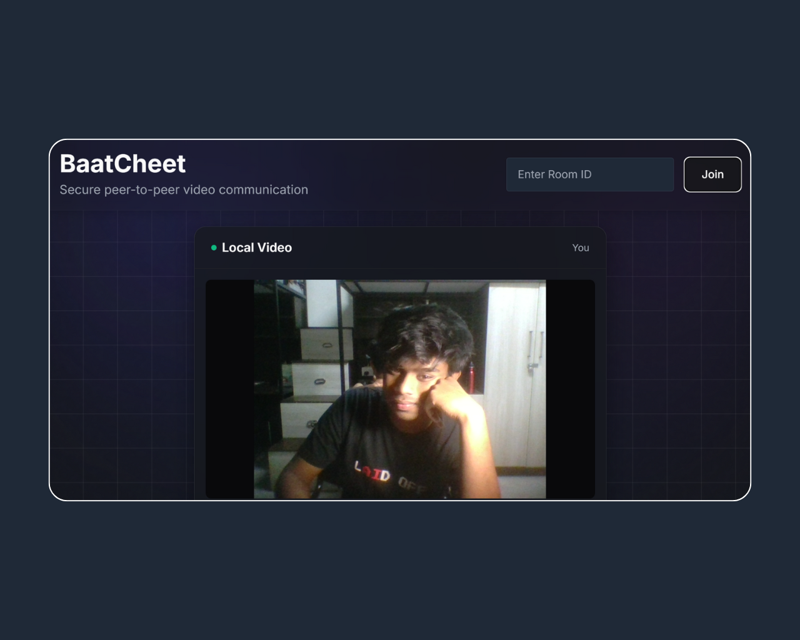
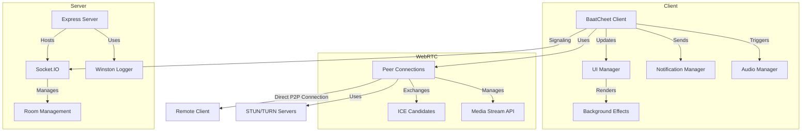
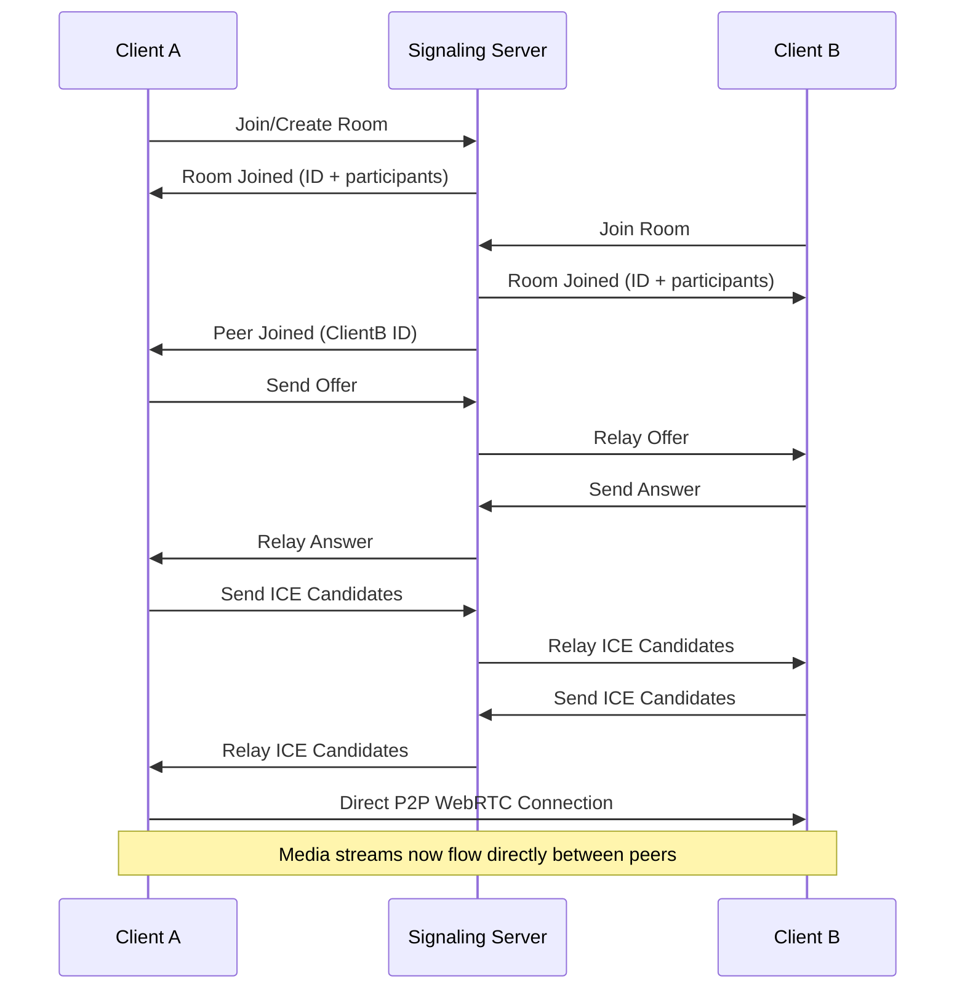
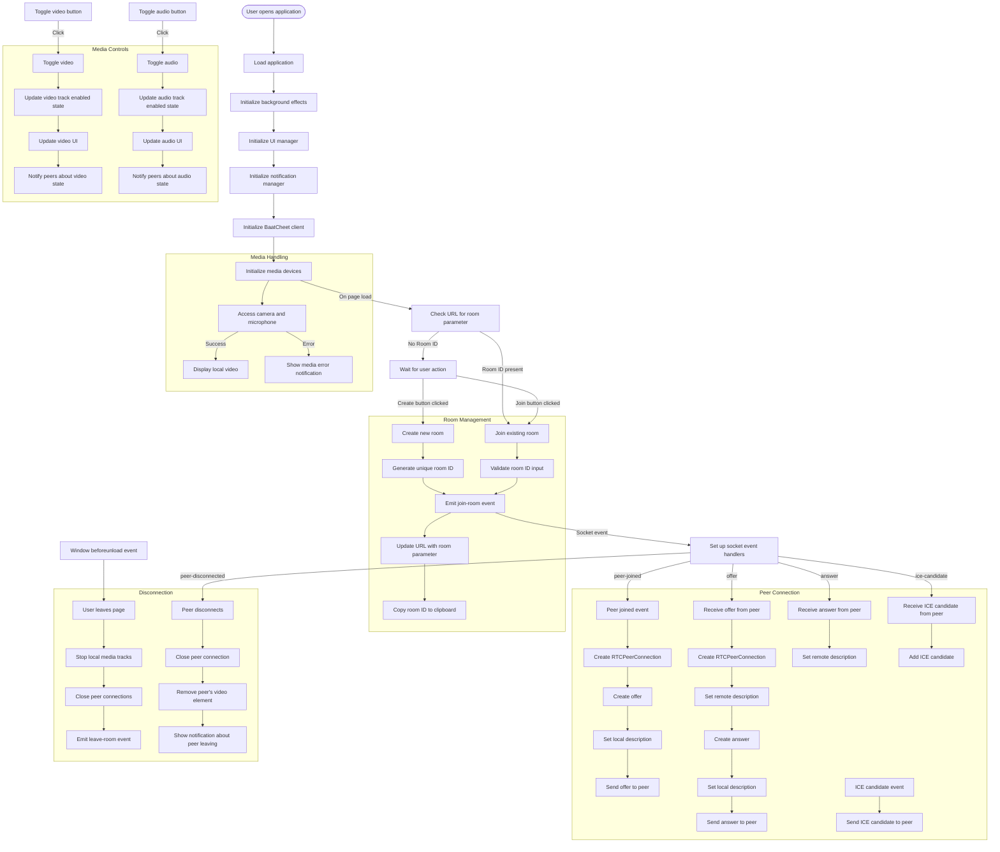

# BaatCheet: Secure P2P Video Communication

<div align="center">
  
  
  
  
</div>

<br>

<!--  -->

## Overview

BaatCheet is a secure peer-to-peer video communication platform built using WebRTC technology. It enables real-time audio and video communication directly between browsers without requiring any plugins or third-party servers for media relay (except in specific NAT traversal scenarios).

## Features

- **Secure P2P Communication**: Direct browser-to-browser communication using WebRTC with encrypted connections
- **Simple Room Creation**: Generate unique room IDs for private conversations
- **Multiple Participant Support**: Connect with multiple peers in the same room
- **Media Controls**: Toggle audio and video streams on/off
- **Responsive UI**: Works seamlessly on desktop and mobile devices
- **Low Latency**: Direct peer connections ensure minimal delay
- **NAT Traversal**: Uses STUN/TURN servers to bypass network restrictions
- **Audio Notifications**: Get notified when peers join or leave
- **Modern UI**: Clean, responsive interface with a dark theme

## 🛠️ Technology Stack

- **Frontend**:
  - Vanilla JavaScript (ES6+)
  - Socket.IO Client
  - WebRTC APIs
  - Tailwind CSS for styling

- **Backend**:
  - Node.js
  - Express
  - Socket.IO for signaling
  - Winston for logging

## 🏗️ Architecture



## 🔄 Connection Flow



## 🔍 Detailed Application Flow



## 📂 Project Structure

```
baatcheet/
├── src/
│   ├── client/
│   │   ├── assets/
│   │   │   └── favicon.ico
│   │   ├── audio/
│   │   │   ├── user-join.mp3    # Sound played when user joins
│   │   │   └── user-leave.mp3   # Sound played when user leaves
│   │   ├── css/
│   │   │   └── styles.css       # Main stylesheet
│   │   ├── js/
│   │   │   ├── app.js           # Entry point for client
│   │   │   ├── background.js    # Background animations
│   │   │   ├── client.js        # WebRTC core functionality
│   │   │   ├── audio-manager.js # Manages audio notifications
│   │   │   ├── notification-manager.js # Manages notifications
│   │   │   └── ui-manager.js    # Manages UI updates
│   │   └── index.html           # Main HTML file
│   └── server/
│       └── server.js            # Express and Socket.IO server
├── .dockerignore
├── .gitattributes
├── .gitignore
├── Dockerfile                   # For containerized deployment
├── LICENCE                      # MIT License
├── package.json
└── README.md
```

## ⚙️ Setup Instructions

### Prerequisites
- Node.js (v14 or higher)
- npm (v6 or higher)

### Local Development

1. Clone the repository:
   ```bash
   git clone https://github.com/arpy8/baatcheet.git
   cd baatcheet
   ```

2. Install dependencies:
   ```bash
   npm install
   ```

3. Start the development server:
   ```bash
   npm run dev
   ```

4. Open your browser and navigate to `http://localhost:7860`

### Production Deployment

#### Using Docker

```bash
# Build the Docker image
docker build -t baatcheet .

# Run the container
docker run -p 7860:7860 baatcheet

# Access the application at http://localhost:7860
```

#### Using Node.js directly

```bash
# Install dependencies
npm install

# Start the production server
npm start

# Access the application at http://localhost:7860
```

## 📘 Usage Guide

### Creating a Room
1. Open the BaatCheet application in your browser
2. Click "Create Room" button
3. The application will generate a unique room ID
4. Share this room ID with others you want to connect with

### Joining a Room
1. Open the BaatCheet application in your browser
2. Enter the room ID in the input field
3. Click "Join Room" button
4. You will be connected to others in the same room

### Media Controls
- Toggle your video on/off using the video button
- Toggle your microphone on/off using the audio button

### Sharing Room Links
You can share a direct link to your room by copying the URL after joining, which will include the room ID as a parameter, e.g., `https://baatcheet.example.com/?room=abc123`

## 🌐 Browser Support

BaatCheet is supported on all modern browsers that implement WebRTC:

| Browser | Minimum Version |
|---------|----------------|
| Chrome  | 60+            |
| Firefox | 55+            |
| Safari  | 11+            |
| Edge    | 79+            |

## 🔐 Security Considerations

- All media streams are transferred directly between peers using encrypted WebRTC connections
- The signaling server only relays connection information and does not have access to media content
- No media data is stored on any server
- STUN/TURN servers are only used for connection establishment, not for media transfer (except when direct connection is impossible)

## Future Enhancements

- End-to-end encryption for signaling
- Screen sharing capability
- Chat functionality alongside video
- Recording options
- Virtual background effects
- More customization options for rooms

## Known Issues

- May not work properly on networks with restrictive firewalls
- Safari on iOS may have limited compatibility
- Performance may vary depending on network conditions and device capabilities

## Contributing

Contributions are welcome! Please feel free to submit a Pull Request.

1. Fork the repository
2. Create your feature branch (`git checkout -b feature/amazing-feature`)
3. Commit your changes (`git commit -m 'Add some amazing feature'`)
4. Push to the branch (`git push origin feature/amazing-feature`)
5. Open a Pull Request

## 📄 License

This project is licensed under the MIT License - see the [LICENSE](LICENSE) file for details.